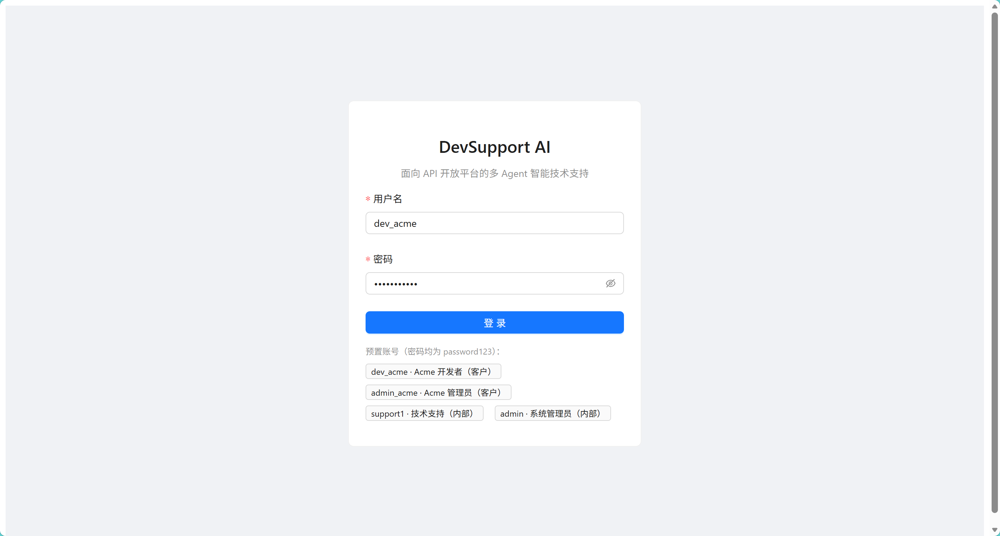
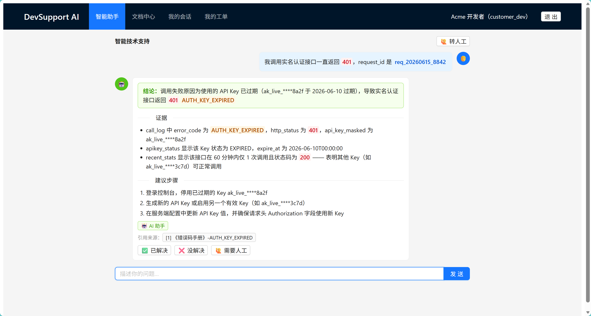
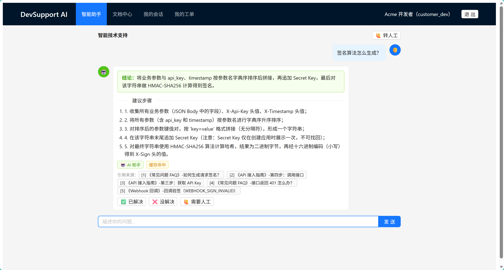
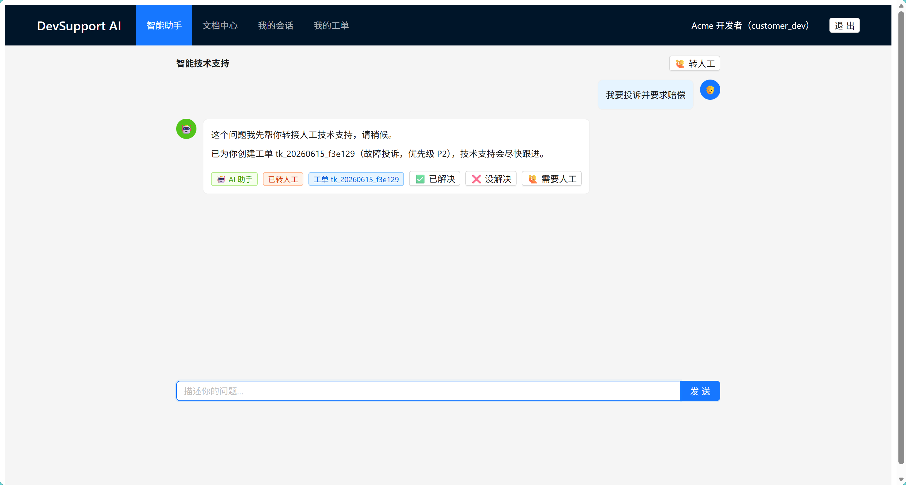
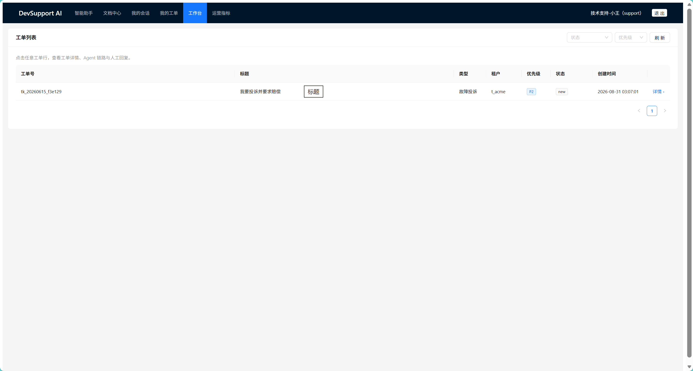
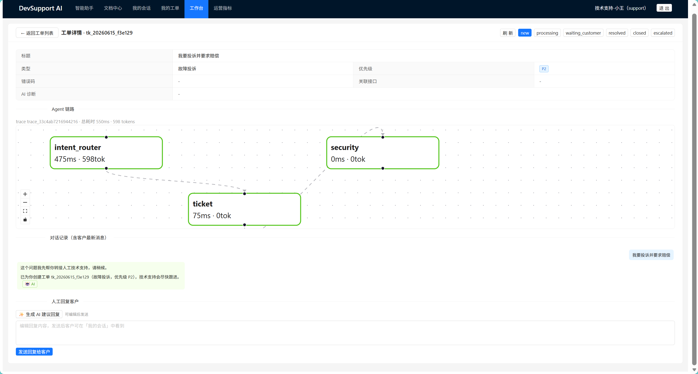

# 🛠️ DevSupport AI · 面向 API 开放平台的多 Agent 智能客服系统

<p align="center">
  <a href="https://github.com/xiaotuolu/DevSupport-AI"></a>
  <a href="https://python.org"></a>
  <a href="https://fastapi.tiangolo.com"></a>
  <a href="https://github.com/langchain-ai/langgraph"></a>
  <a href="https://react.dev"></a>
  <a href="https://milvus.io"></a>
  <a href="https://redis.io"></a>
  <a href="https://www.mysql.com"></a>
  <a href="LICENSE"></a>
</p>

如果这个项目对你的学习、研究或 Agent 相关面试准备有帮助，欢迎点一个 Star，也欢迎提交 Issue 分享建议。

**一个可运行的工程化 AI Agent 学习与演示项目**

开发者提出 API 接入问题 → AI 识别意图 → 多 Agent 协同查文档、查日志、查账单 → 输出诊断结论和修复步骤 → 复杂/高风险问题自动建单转人工。

---

## 📖 目录

- [🌟 项目简介](#-项目简介)
- [💡 核心场景](#-核心场景)
- [🎬 功能展示](#-功能展示)
- [🧭 功能演示入口](#-功能演示入口)
- [✨ 技术亮点与实现边界](#-技术亮点与实现边界)
- [🏗️ 系统架构](#️-系统架构)
- [🔄 多 Agent 工作流](#-多-agent-工作流)
- [🔍 RAG 检索链路](#-rag-检索链路)
- [📂 项目结构](#-项目结构)
- [🎓 面试准备资料](#-面试准备资料)
- [📊 评估与本地基准](#-评估与本地基准)
- [🛡️ 安全边界与当前限制](#️-安全边界与当前限制)
- [🚀 快速启动](#-快速启动)
- [🛠️ 常用命令](#️-常用命令)
- [🧰 核心技术栈](#-核心技术栈)
- [📄 许可证](#-许可证)

---

## 🌟 项目简介

DevSupport AI 是一个面向 API 开放平台开发者的多 Agent 智能技术支持系统，帮助使用第三方 API 的开发者处理数据查询、身份认证、风控评分、企业认证和 Webhook 回调等接入问题。

项目代码面向免费学习、研究和个人使用；运行时需要自行配置 DashScope API Key，第三方模型调用会产生相应费用。

开发者在接入 API 时，经常会遇到鉴权失败、签名错误、限流、回调失败、账单异常、数据质量异常等问题。传统客服需要反复询问 `request_id`、接口名、错误码，再去查文档、网关日志、套餐账单和历史工单，排查链路长、人工成本高。

本项目将这些能力整合进一个多 Agent 系统：

- 🧭 能理解开发者的自然语言问题。
- 📚 能检索 API 文档并生成带引用回答。
- 🔎 能查询调用日志、API Key 状态和错误码。
- 💳 能解释套餐、调用量和账单变化。
- 🎫 能在不确定或高风险时自动创建工单转人工。
- 🛡️ 能对 API Key、Token、手机号、邮箱等敏感信息进行识别和脱敏处理。

一句话概括：**把 API 文档、调用日志、错误码、套餐账单、工单系统和安全脱敏，编排成一个可运行、可观测、可评估的多 Agent 智能客服系统。**

---

## 🎬 功能展示

以下截图来自本地演示环境，页面中的账号、工单号、请求 ID 和 API Key 均为演示数据或脱敏数据。

### 💬 登录与客户侧智能助手









### 🎫 工单与内部技术支持工作台





---

## 🧭 功能演示入口

登录后可以按角色访问以下页面。内部工作台和运营指标仅对内部角色开放。

| 页面 | 前端路径 | 可查看内容 | 角色 |
| --- | --- | --- | --- |
| 智能助手 | `/` | 对话、诊断卡片、引用、澄清和转人工 | 客户侧与内部角色 |
| 文档中心 | `/docs` | 知识库文档和文档详情 | 客户侧与内部角色 |
| 我的会话 | `/conversations` | 会话列表与历史消息 | 客户侧与内部角色 |
| 我的工单 | `/tickets` | 当前租户的工单列表和详情 | 客户侧与内部角色 |
| 技术支持工作台 | `/workbench` | 工单处理、Agent Trace、人工接管和回复 | 内部角色 |
| 运营指标 | `/metrics` | Token 用量、链路统计和评估入口 | 内部角色 |

---

## 💡 核心场景

| 场景 | 示例问题 | 系统处理方式 |
| --- | --- | --- |
| 鉴权失败诊断 | `我调用实名认证接口一直返回 401` | 追问或读取 `request_id`，查询日志、Key 状态和 401 文档，输出原因、证据和修复步骤 |
| 限流问题分析 | `今天下午很多 429，是不是你们服务挂了？` | 并发查询调用统计、套餐 QPS 和相关文档证据，判断是否超出套餐限制 |
| 文档问答 | `签名算法怎么生成？` | RAG 混合检索 + Rerank，生成带引用的步骤说明 |
| 账单解释 | `这个月费用为什么涨这么多？` | 查询本月/上月用量和费用构成，解释增长原因 |
| 信息不全 | `接口一直失败，帮我看看` | 不强行编造，先澄清接口名、错误码、`request_id` 等关键实体 |
| 人工兜底 | `我要投诉并要求赔偿` | 识别高风险请求，整理上下文并创建工单转人工 |

---

## ✨ 技术亮点与实现边界

### 🤖 1. 多 Agent DAG 协作编排

不是一个 Prompt 走天下，而是通过 LangGraph 将多个专业 Agent 编排成可追踪的工作流。严格按“实际使用 LLM 执行专业任务”的口径，当前有 4 个 Agent：`IntentRouter`、`DocRAGAgent`、`APIDiagnosticAgent` 和 `BillingAgent`。`Supervisor` 是确定性编排器，工单和安全审查是规则节点，不把它们包装成自主 Agent。

| Agent / 节点 | 职责 |
| --- | --- |
| `IntentRouter` | 意图识别、实体抽取、路由决策 |
| `Supervisor` | 根据静态 `ROUTE_MAP` 调度专业处理链路；专业角色在 `specialists_node` 内部并发执行 |
| `DocRAGAgent` | 检索知识库，生成带引用的文档回答 |
| `APIDiagnosticAgent` | 查询调用日志、API Key 状态和错误码信息 |
| `BillingAgent` | 查询套餐、调用量和费用构成，解释账单变化 |
| `ticket_node` | 低置信度或高风险问题自动建单转人工 |
| `security_node` | 最终安全审查与敏感信息脱敏 |

### 🎯 2. 面向真实 API 客服业务建模

项目覆盖 API 接入过程中常见的 401 鉴权失败、403 权限不足、429 限流、签名错误、Webhook 回调失败、账单异常、套餐 QPS 不足和数据质量异常等问题，服务对象是使用开放平台 API 的开发者及技术支持人员。

### 🧠 3. 意图路由 + 实体记忆

系统会先抽取接口名、错误码、`request_id`、时间范围等关键实体。缺失信息时主动追问；用户补充后写入当前会话记忆，后续无需重复提供。

### 🔍 4. RAG 混合检索 + Rerank

文档问答不是简单调用向量库，而是使用 Milvus 向量检索 + BM25 关键词检索 + RRF 融合 + Rerank 精排 + 上下文压缩，最终生成带引用回答。

### 🧰 5. 工具调用中心

日志查询、API Key 状态查询、错误码查询、账单查询、工单创建等能力统一封装为工具，并加入超时、重试、结果脱敏和高危操作隔离。

### 🛡️ 6. 三层安全脱敏

工具调用参数与结果的审计日志、人工回复和最终输出会进行敏感信息处理，覆盖 API Key、Secret、Token、手机号、邮箱、身份证、银行卡、签名参数等。

### ⚡ 7. 缓存与性能优化

通过语义缓存、路由缓存、错误码热路径直取、多 Agent 并行、链路裁剪、模型分层、上下文压缩等方式降低响应延迟和 Token 用量。

### 📊 8. 全链路可观测与评估

每轮对话记录意图、实体、Agent 执行路径、节点耗时、Token 消耗、工具调用、RAG 引用、缓存命中和转人工状态，并在前端用 React Flow 展示链路。

---

## 🏗️ 系统架构

```text
┌──────────────────────────────────────────────────────────────┐
│                        用户交互层                             │
│  React 前端 · 智能助手 · 我的工单 · 内部工作台 · 运营指标       │
│  FastAPI REST API · SSE 结果分块（伪流式）· JWT 鉴权 · 多租户隔离 │
└──────────────────────────────────────────────────────────────┘
                              │
                              ▼
┌──────────────────────────────────────────────────────────────┐
│                        Agent 编排层                           │
│  IntentRouter → Supervisor                                    │
│      ├── DocRAGAgent                                          │
│      ├── APIDiagnosticAgent                                   │
│      ├── BillingAgent                                         │
│      ├── ticket_node                                          │
│      └── security_node                                        │
└──────────────────────────────────────────────────────────────┘
                              │
                              ▼
┌──────────────────────────────────────────────────────────────┐
│                        基础能力层                             │
│  DashScope LLM · Embedding · Rerank · Milvus · BM25           │
│  MySQL · Redis · 工具中心 · Trace · Token 用量统计 · 评估压测   │
└──────────────────────────────────────────────────────────────┘
```

---

## 🔄 多 Agent 工作流

```text
START
  │
  ▼
[IntentRouter]
  │
  ├── 信息不足 ───────────────► [Clarify] ─────────────► END
  │
  ▼
[Supervisor]
  │
  ├── doc_qa ─────────────────► [DocRAGAgent] ────────┐
  ├── api_error/data_quality ─► [APIDiagnosticAgent] ─┤
  ├── rate_limit ─────────────► [诊断 + 账单处理] ─────┤
  ├── billing ────────────────► [BillingAgent] ───────┤
  └── ticket ─────────────────► [ticket_node] ────────┤
                                                       ▼
                                             [Summarize Result]
                                                       │
                                                       ▼
                                                [security_node]
                                                       │
                                                       ▼
                                            Reply / Ticket / Trace
```

代码中的完整意图集合是 `doc_qa`、`api_error`、`rate_limit`、`billing`、`data_quality`、`ticket` 和 `chitchat`。整体 LangGraph 图按节点串行推进；并行只发生在 `specialists_node` 内部，通过 `asyncio.gather` 执行多个专业处理角色，`APIDiagnosticAgent` 内部还会并行查询多路证据。

当前 SSE 属于结果级分块展示：后端先完成一次编排，再按固定字符块发送结果，不是 LLM token 级实时流式输出。

建图实现位于 [`backend/app/agents/supervisor.py`](backend/app/agents/supervisor.py) 的 `build_graph()`：

- 节点：`load_context` → `intent` → `clarify` / `specialists` → `ticket` → `summarize` → `security`。
- 普通边：`START → load_context → intent`，以及 `specialists → ticket → summarize → security → END`。
- 条件边：`intent` 根据 `after_intent` 的结果进入 `clarify` 或 `specialists`；`clarify` 直接结束。
- `specialists` 节点内部根据 `ROUTE_MAP` 选择专业处理角色，并通过 `asyncio.gather` 并发执行。

以 `今天下午一堆 429，是不是你们服务挂了？` 为例，系统会并行查询调用日志、套餐 QPS 和限流文档，再综合判断是平台故障还是租户超出套餐限制，并给出限速、退避或升级套餐建议。

---

## 🔍 RAG 检索链路

```text
用户问题
  │
  ├── 向量检索 Milvus：召回语义相近文档
  ├── BM25 检索：召回错误码、接口名、参数名等关键词文档
  │
  ▼
RRF 融合去重
  │
  ▼
Rerank 精排
  │
  ▼
上下文压缩
  │
  ▼
LLM 生成带引用答案
  │
  ▼
安全审查与脱敏
```

混合检索的原因：API 文档中包含大量错误码、字段名、接口名，关键词检索更稳定；而自然语言提问又需要语义检索补足召回。两路融合后再重排，可以兼顾召回率和准确率。

---

## 📂 项目结构

```text
DevSupport-AI/
├── backend/
│   ├── app/
│   │   ├── agents/              # LLM Agent 与工作流节点：路由、文档、诊断、账单、安全
│   │   ├── api/                 # FastAPI 路由：chat、tickets、docs、traces、workbench
│   │   ├── rag/                 # 知识库入库、混合检索、Rerank、上下文压缩、Milvus 存储
│   │   ├── tools/               # 工具注册与工具实现
│   │   ├── guardrail/           # 脱敏与兜底
│   │   ├── cache/               # Redis、语义缓存、路由缓存
│   │   ├── memory/              # 会话记忆
│   │   ├── llm/                 # LLM 客户端与模型路由
│   │   └── observability/       # Trace 与 Token 用量统计
│   ├── scripts/                 # 建表、种子数据、知识库入库
│   ├── eval/                    # 评估脚本
│   └── benchmark/               # 压测脚本
├── frontend/
│   └── src/
│       ├── pages/               # Chat、Tickets、Workbench、Metrics、Docs
│       ├── components/          # DiagnosisCard、TraceFlow、Highlight
│       └── api.ts               # 前端 API 客户端
├── data/knowledge/              # RAG 知识库文档
├── docs/images/                 # README 功能截图
├── docs/interview-prep/         # 项目相关的面试准备资料
├── docker-compose.yml           # MySQL / Redis / Milvus / MinIO
├── Makefile                     # 常用命令
└── README.md                    # 项目说明与运行指南
```

---

## 🎓 面试准备资料

仓库的 `docs/interview-prep/` 目录同时提供项目相关的面试准备材料，适合研究项目实现细节和准备 Agent 方向面试。

内容为个人面试经历整理，仅供学习和准备 Agent 相关面试参考。

- [`INTERVIEW_PREP.md`](docs/interview-prep/INTERVIEW_PREP.md)：基于当前代码整理的硬事实、架构链路、高频追问和复习顺序。
- [`DEVSupport-面试准备.md`](docs/interview-prep/DEVSupport-面试准备.md)：项目介绍、面试口径提醒和问题清单。
- [`DevSupport-AI_interview_QA.docx`](docs/interview-prep/DevSupport-AI_interview_QA.docx)：Word 版面试题与答案，包含本项目在字节一二面中被问到的题目。

---

## 📊 评估与本地基准

项目提供可重复运行的本地评估和基准脚本，用于研究 Agent 应用的质量与链路开销：

- 标准评估集包含 15 条主用例，另有 8 条敏感信息脱敏用例。
- 评估关注 6 项指标：意图识别、实体抽取、引用、转人工、主动澄清和脱敏。
- 评估采用规则断言，不依赖 LLM Judge，并会输出 Badcase 线索。
- `backend/benchmark/loadtest.py` 测试的是本地 `supervisor.run()` 链路和阶段耗时，不是完整的 HTTP 生产压测。

运行命令：

```bash
make eval
make bench
```

---

## 🛡️ 安全边界与当前限制

- 高风险工具默认不暴露给 AI；工具调用还会受到租户和角色权限约束。
- 工具调用参数与结果的审计日志、人工回复和最终输出会经过脱敏处理；当前客户原始消息写入会话表前未统一脱敏，处理真实敏感数据时需要进一步加固。
- 当前没有专门的 Prompt Injection 攻击检测器，不能将项目描述为完整的 Prompt Injection 防护方案。
- 当前前端没有图片、视频或日志文件上传能力。
- `.env.example` 中的 JWT Secret、数据库密码，以及 `docker-compose.yml` 中的 MySQL、Redis、MinIO 默认凭据仅用于本地演示，不能直接用于生产环境。
- 项目定位是可运行的学习和研究示例；部署到真实生产环境前，需要根据组织的认证、密钥、审计和运维要求进行加固。

---

## 🚀 快速启动

### ⚙️ 环境要求

- Docker + Docker Compose v2
- Python 3.11+
- Node.js 18+
- DashScope API Key

本项目的 Docker Compose 主要用于本地 MySQL、Redis、Milvus、etcd 和 MinIO 基础设施编排，README 提供的是本地运行方式。

### 1️⃣ 安装后端依赖

```bash
cd backend
python -m venv .venv
source .venv/bin/activate
pip install -e ".[dev]"
cp .env.example .env
```

Windows PowerShell：

```powershell
cd backend
python -m venv .venv
.\.venv\Scripts\Activate.ps1
pip install -e ".[dev]"
copy .env.example .env
```

在 `.env` 中填入：

```env
DASHSCOPE_API_KEY=your_dashscope_api_key
```

### 2️⃣ 安装前端依赖

```bash
cd ../frontend
npm install
cd ..
```

### 3️⃣ 启动基础设施

```bash
make infra-up
make infra-status
```

### 4️⃣ 初始化数据

```bash
make setup
```

### 5️⃣ 启动服务

```bash
make run
make front
```

后端默认运行在 `http://127.0.0.1:8000`，前端运行在 `http://127.0.0.1:5173`。访问：`http://127.0.0.1:5173`

如果本机没有端口冲突，也可以将 `frontend/vite.config.ts` 和 Makefile 中的后端端口统一改为其他可用端口。

预置账号密码统一为 `password123`：

| 账号 | 角色 | 用途 |
| --- | --- | --- |
| `dev_acme` | 开发者 | 客户侧对话、查看工单 |
| `admin_acme` | 客户管理员 | 客户侧管理视角 |
| `support1` | 技术支持 | 内部工作台、接管工单 |
| `admin` | 系统管理员 | 运营指标、评估入口 |

---

## 🛠️ 常用命令

```bash
make infra-up       # 启动 MySQL / Redis / Milvus
make infra-status   # 查看基础设施健康状态
make setup          # 建表 + 种子数据 + 知识库入库
make run            # 启动后端服务
make front          # 启动前端服务
make health         # 后端健康检查
make eval           # 运行评估集
make bench          # 运行压测脚本
make clean          # 清理容器和数据卷
```

如果 Windows 环境没有安装 `make`，可以在两个终端中分别运行：

```powershell
# 终端一：启动基础设施和后端
docker compose up -d
cd backend
.\.venv\Scripts\python.exe -m uvicorn app.main:app --host 127.0.0.1 --port 8000

# 终端二：启动前端
cd frontend
npm run dev -- --host 127.0.0.1
```

`make bench` 使用本地 `supervisor.run()` 链路进行基准测试，不是完整的 HTTP 生产压测；项目不在 README 中宣传未经重新确认的历史性能数字。

---

## 🧰 核心技术栈

| 分类 | 技术 | 用途 |
| --- | --- | --- |
| Agent 编排 | LangGraph / langchain-core | 多 Agent DAG 编排 |
| Web 框架 | FastAPI / Uvicorn | REST API、SSE、鉴权、路由 |
| LLM | DashScope qwen-turbo / qwen-plus | 意图识别、总结、问答生成 |
| Embedding | text-embedding-v3 | 知识库向量化 |
| Rerank | gte-rerank-v2 | 检索结果精排 |
| 向量数据库 | Milvus 2.4 | 文档向量存储与召回 |
| 关键词检索 | BM25 / jieba | 错误码、接口名、参数名召回 |
| 关系数据库 | MySQL 8 / SQLAlchemy 2.0 | 用户、会话、工单、日志、账单、trace |
| 缓存 | Redis 7 | 会话记忆、语义缓存、路由缓存 |
| 前端 | React 18 / TypeScript / Vite | 客户侧和内部侧页面 |
| UI / 可视化 | Ant Design / React Flow | 页面组件与 Agent 链路展示 |
| 部署 | Docker Compose | 本地基础设施编排 |

---

## 📄 许可证

本项目采用 [MIT License](LICENSE)。

